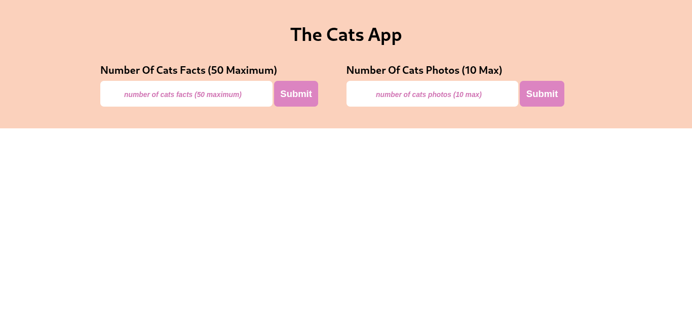

# 🐱 Random Cat Image & Fact Web App

This is a simple, responsive web application that displays random cat images using [The Cat API](https://thecatapi.com/) and random cat facts using the [meowfacts](https://meowfacts.herokuapp.com/) API. Built with HTML, CSS, and JavaScript.It features async data fetching via Axios and smooth UX with a custom loader animation.



## 🛠️ Features

- Fetch and display random cat images  
- Generate fun and random cat facts  
- Async data fetching with Axios  
- Fully responsive layout  
- Loader animation for visual feedback 


## Getting Started

To run this project locally:

### Step 1: Clone the repo

```bash
git clone https://github.com/charles-254/Cat-App.git
```

### Step 2: Navigate into the project folder

```bash
cd Cat-App
```

### Step 3: Install dependencies

```bash
npm install
```

### Step 4: Run the development server

```bash
npm run dev
```